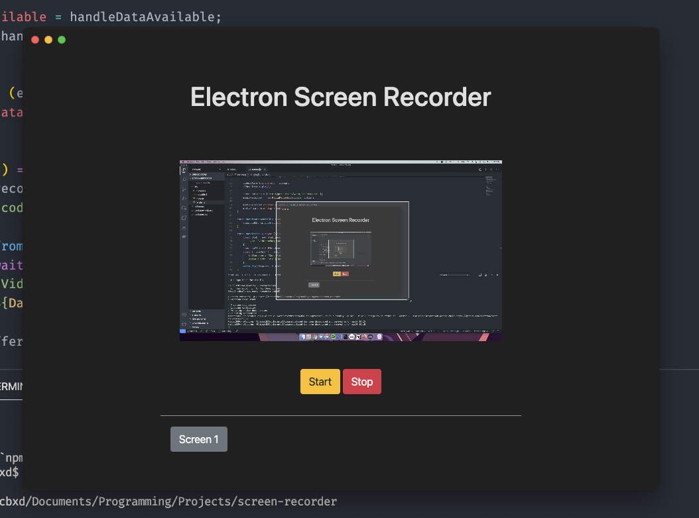
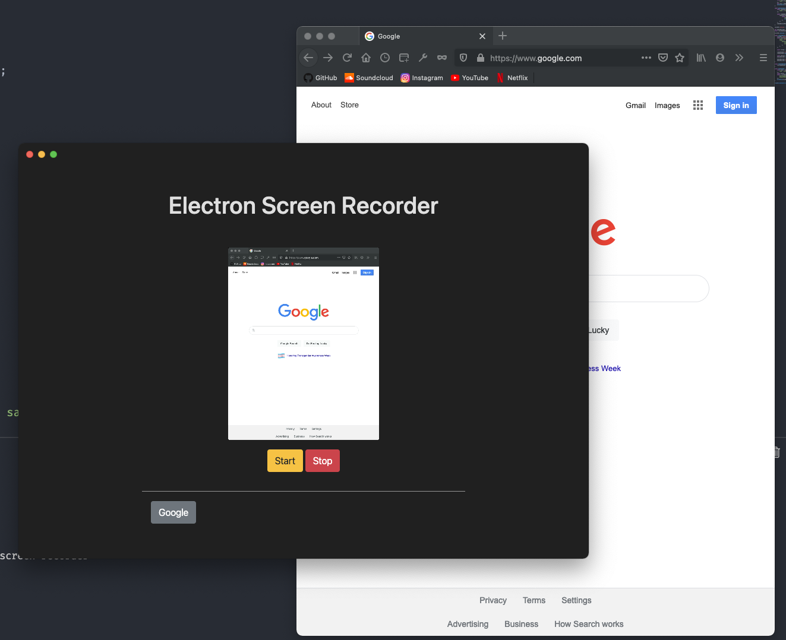
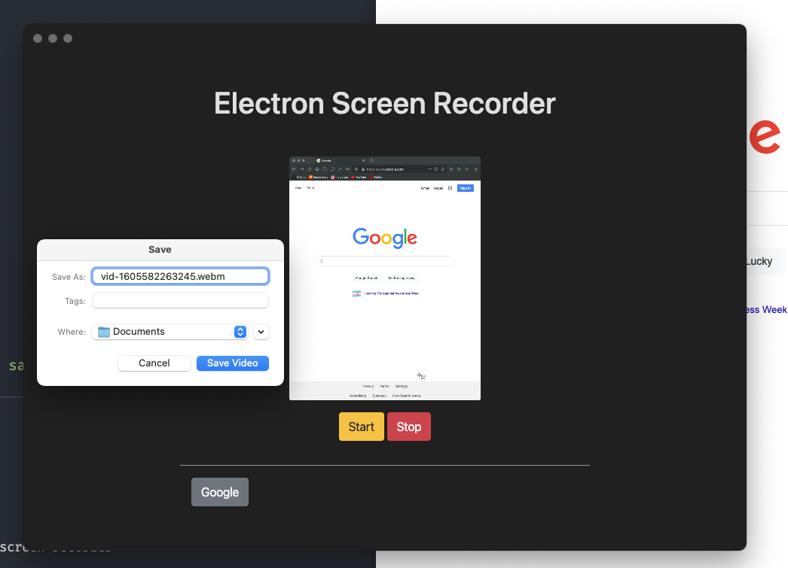

# Screen Recording App
A screen recording app made using JavaScript. Includes native APIs for operating files.

I wanted to keep learning Electron.js, a JavaScript framework for creating desktop apps using HTML, CSS, and JS.

# Functionality
- Sound Recording
- Video Recording
- Ability to choose a screen or a window to record

# Tech Used:
- HTML
- CSS
- JS
- NODE.JS
- ELECTRON.JS

# Main App View

# Choosing a window to record

# Native APIs to save the file

